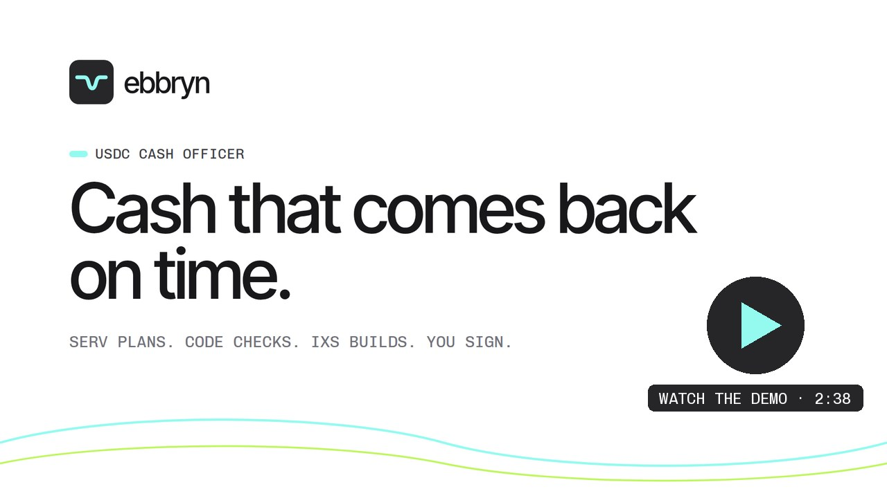
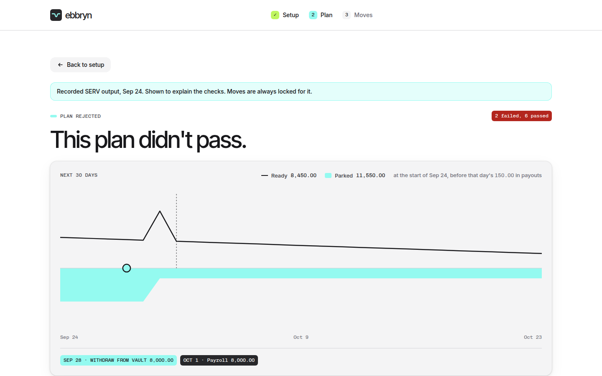
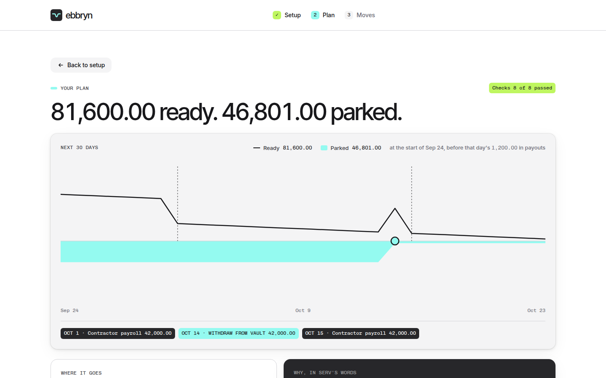
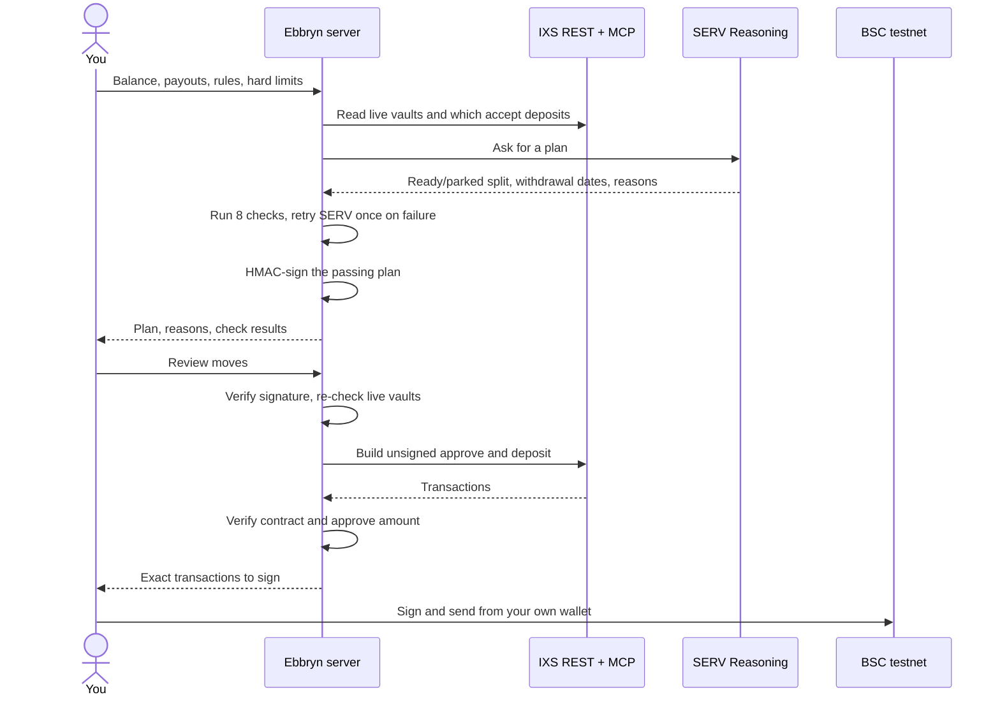
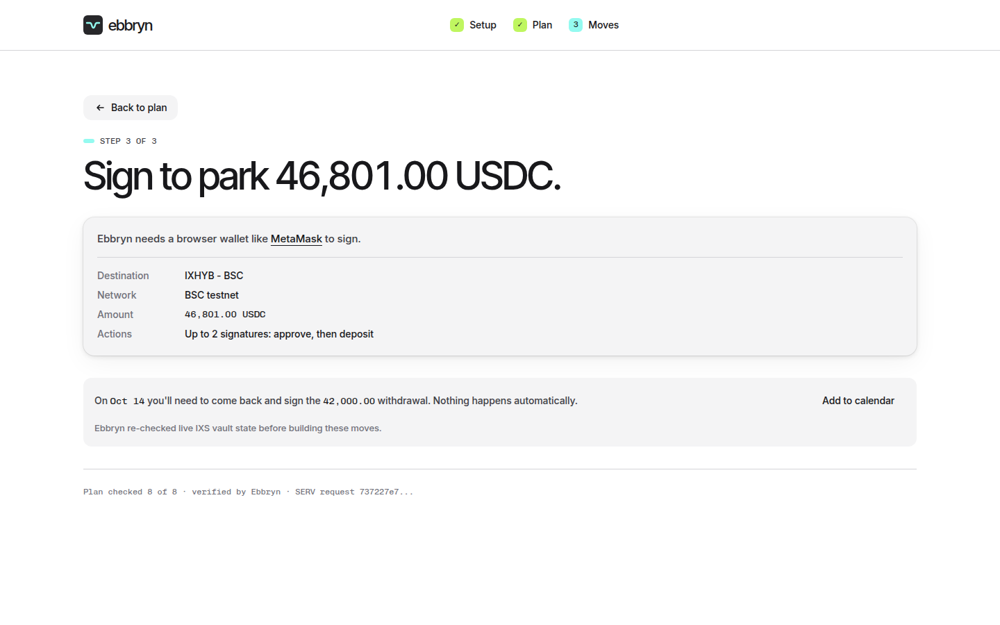

# Ebbryn

[](https://github.com/mystiquemide/ebbryn/actions/workflows/ci.yml)
[](LICENSE)
[](https://ebbryn.midelabs.xyz/?via=gh)
[](https://testnet.bscscan.com/address/0xCb09a5326AEFD705d14FF4C5ca2beD7086ba0Dcc)
[](https://www.openserv.ai/hackathon)

**Cash that comes back on time.** Ebbryn parks the USDC a business holds for payroll in IXS RWA vaults and brings it back before each payout. SERV plans it, code checks it, and you sign every move.

Built for the OpenServ SERV Hackathon, Edition 01, Open Track.

[Live app](https://ebbryn.midelabs.xyz/?via=gh) · [Plan my cash](https://ebbryn.midelabs.xyz/setup?via=gh) · [Rejected plan](https://ebbryn.midelabs.xyz/plan?case=recorded&via=gh) · [Docs](https://ebbryn.midelabs.xyz/docs?via=gh) · [Live vaults API](https://ebbryn.midelabs.xyz/api/vaults) · [IXS integration notes](https://github.com/IXS-Finance/ixs-rwa-agent-skills/issues/5)

[](https://youtu.be/ZeZf_biVHnE)

## The problem

Businesses that pay contractors or run AI agents in USDC keep weeks of payouts sitting idle. Holding USDC pays nothing, and US law now bars stablecoin issuers from paying yield on it.

Parking that cash in a yield vault is easy. Getting it back before payday, every time, is the hard part. Redemptions take time, and if the money isn't back when payroll is due, people don't get paid. Today a finance lead works this out by hand in a spreadsheet, or leaves the cash idle.

## The solution

You enter your balance, your upcoming payouts and your cash rules in plain English. Ebbryn asks SERV Reasoning for a plan: how much stays ready in your wallet, how much is parked in an IXS vault, and when to withdraw so the money lands before each payout.

The model is never trusted on its own. In testing, SERV kept 8,000 USDC ready for payroll and also scheduled an 8,000 USDC withdrawal for the same payroll. Ebbryn's checks caught it and nothing moved:



A plan that passes all eight checks is signed by the server, IXS builds the unsigned transactions, and you sign them in your own wallet. Ebbryn never holds keys or funds.



## Try it

No install needed. Open [ebbryn.midelabs.xyz](https://ebbryn.midelabs.xyz/?via=gh) and:

1. Click **See a real plan** to watch the eight checks reject the recorded SERV plan that counted payroll twice.
2. Click **Plan my cash**, keep the Payroll team template, and click **Plan my cash** again. A live SERV plan comes back in about 40 seconds to 2 minutes, with a 30-day chart, SERV's reasons and the check results.
3. Change a rule, for example "keep at least half the balance ready", and plan again. The reasons quote the rule you changed.
4. Click **Review moves** and connect a browser wallet on BSC testnet. You see the exact approve and deposit you would sign, plus a calendar reminder for each withdrawal date.

Planning uses shared SERV credits, so it's limited to 5 plans per IP every 10 minutes.

## How it works



| Step | Who decides | What happens |
|---|---|---|
| Setup | You | Balance, payouts (one-off, daily or twice a month), plain-English rules, two hard limits: max % parked and extra buffer days |
| Plan | SERV | Proposes the ready/parked split, withdrawal dates and a reason for each choice that quotes your rule |
| Check | Code | Eight deterministic checks. A failing plan goes back to SERV once with the failures. If it still fails, moves stay locked |
| Seal | Code | A passing plan is HMAC-signed so it can't be edited in the browser before moves are built |
| Build | IXS | IXS MCP returns unsigned approve and deposit transactions. Ebbryn rejects any transaction aimed at an unexpected contract and checks the approve amount matches the deposit |
| Sign | You | You sign every transaction, including each later withdrawal |

The rule of the design: judgment goes to the model, arithmetic goes to code. SERV weighs competing goals like your buffer rules, payout dates and withdrawal lag. Code owns every sum, date and limit.

## Integrations

### SERV Reasoning (OpenServ)

| What | Detail |
|---|---|
| Endpoint | `https://inference-api.openserv.ai/v1/chat/completions` via the OpenAI SDK, in [`src/lib/serv.ts`](src/lib/serv.ts) |
| Model | `gpt-6-luna-serv-kronos-multipath` |
| Kronos + Multipath | The planning problem has branches: fund a payout from ready cash, or park it and withdraw in time. Multipath explores those options against your rules |
| Shadow Agent | The `serv_shadow_agent` tool reviews the draft before it's returned, with a hint that restates the funding rules |
| Structured output | Strict `json_schema`, so every plan has the same shape and every reason names the rule it follows |
| Prompt caching | The system prompt is static and your rules go in the user message, so SERV can reuse its generated reasoning prompt |
| Traceability | Every plan shows its SERV request id |

API notes from building: a system message is required, `temperature` isn't supported, and the limit is `max_completion_tokens`. A 402 means the credit balance is too low, and Ebbryn shows a plain "planning is paused" message.

### IXS Finance

| What | Detail |
|---|---|
| Vault discovery | REST `GET https://api-dev-v2.ixs.finance/vaults`, in [`src/lib/ixs.ts`](src/lib/ixs.ts) |
| Vault details | MCP `vault_get` for settlement type (instant or by request) |
| Deposits open? | MCP `vault_build_request_deposit` with a probe address. If IXS refuses, the vault is marked paused and SERV can't park there |
| Transactions | MCP `vault_build_request_deposit` for the real approve and deposit, in base units |
| Target vault | IXHYB - BSC `0xCb09a5326AEFD705d14FF4C5ca2beD7086ba0Dcc`, BSC testnet (chain 97), withdraw anytime |

Found while building and reported in [IXS-Finance/ixs-rwa-agent-skills#5](https://github.com/IXS-Finance/ixs-rwa-agent-skills/issues/5): the Avalanche and Arc vaults accept no deposits, `vault_request_status` errors, parallel MCP calls hang, and `vaults_list` returns a subset. Ebbryn queues MCP calls one at a time, retries once on timeout, and reads discovery from REST.

**What works and what's next.** Ebbryn reads IXS's vault API and uses IXS MCP to build the exact approve and deposit, verified before you sign. IXS's testnet is internal with no public test USDC, so testnet deposits can't be funded. IXS mainnet vaults (BSC `0xc975a3EeF2e49F8eDdEf585340C43f15300fCB82`, Avalanche `0xaD01573b459805E3954398796203d830B57A8bD9`) accept real deposits from $100. Pointing Ebbryn at them is a network and API switch, not a redesign.

## The eight checks

Every plan runs through [`src/lib/check.ts`](src/lib/check.ts). One failure locks moves.

| Check | Rule |
|---|---|
| `SUM` | Ready plus parked equals the balance |
| `CAP` | Nothing parked above your hard limit, even if your rules text asks for more |
| `CLOSED` | Money only goes into vaults taking deposits right now |
| `COVER_ONCE` | Every payout is funded exactly once, never twice and never skipped |
| `LIQUID_COVER` | Ready cash covers the payouts it funds plus your buffer days |
| `TIMING` | Each withdrawal lands at least a day before the payout it funds |
| `REDEEM_LE_PARKED` | You never withdraw more than you parked |
| `SHORTFALL` | If payouts exceed the balance, nothing is parked |

## Proof

| Case | Result | Evidence |
|---|---|---|
| SERV counts the same payroll twice | Rejected by `COVER_ONCE` and `LIQUID_COVER`, moves locked | [`serv-double-count.json`](src/fixtures/serv-double-count.json), [`check.test.ts`](src/lib/check.test.ts) |
| Payroll plan on the live URL | 8 of 8 on the first attempt: 81,600 ready, 46,801 parked, 42,000 withdrawn Oct 14 for the Oct 15 payroll | SERV request `4e20751a-7866-4b12-ac69-4fa3eec5aca8` |
| Rules text says "park 100%" | `CAP` fails, hard limits win | [`check.test.ts`](src/lib/check.test.ts) |
| Plan edited in the browser | `/api/moves` returns 400, nothing built | [`guard.test.ts`](src/lib/guard.test.ts) |
| Planning spammed from one IP | 429 after 5 plans in 10 minutes, 200 a day, counted in Redis across server instances | [`guard.test.ts`](src/lib/guard.test.ts), [`ratelimit.ts`](src/lib/ratelimit.ts) |
| Chart honesty | Wallet never negative, ready + parked + paid always equals the balance | [`timeline.test.ts`](src/lib/timeline.test.ts) |
| USDC conversion | 75,600 USDC becomes `75600000000` base units with no float error | [`units.test.ts`](src/lib/units.test.ts) |

Lint, typecheck, 37 tests and a production build run on every push in [CI](.github/workflows/ci.yml).



## Business model

Ebbryn keeps 15% of the yield it earns for a customer and charges nothing when it earns nothing. 500,000 USDC parked at 6% earns 30,000 USDC a year, and Ebbryn keeps 4,500. A second line is a referral share from IXS on new vault deposits.

First customers: non-US companies paying 10 to 50 contractors in USDC, and operators running fleets of AI agents that need daily wallet top-ups.

## Limitations

- Hackathon code, unaudited, testnet only. Don't use it with real funds.
- No deposit is broadcast. IXS confirmed its testnet is internal and has no public test USDC, and its mainnet vaults take real deposits from $100. Ebbryn plans against IXS's live testnet vaults and builds and checks the exact approve and deposit, but a wallet can't fund them on testnet.
- Withdrawals are planned, not automated. You come back on the date and sign, with an "Add to calendar" reminder.
- Mainnet IXS vaults require IXS verification (KYC).
- Setup and plans are stored in your browser. There are no accounts.

## Run it locally

Requires Node.js 22 and a SERV API key from [console.openserv.ai](https://console.openserv.ai).

```bash
git clone https://github.com/mystiquemide/ebbryn.git && cd ebbryn
npm install
cp .env.example .env.local   # then fill in the values below
npm test
npm run dev                  # http://localhost:3000
```

| Variable | Required | Purpose |
|---|---|---|
| `SERV_API_KEY` | Yes | SERV Reasoning API key |
| `PLAN_SIGNING_SECRET` | Yes | 32+ characters, signs passing plans |
| `SERV_MODEL` | No | Defaults to `gpt-6-luna-serv-kronos-multipath` |
| `IXS_MCP_URL` | No | Defaults to the IXS testnet MCP |
| `NEXT_PUBLIC_BSC_TESTNET_RPC` | No | RPC for balance and allowance reads |
| `KV_REST_API_URL`, `KV_REST_API_TOKEN` | No | Upstash Redis for shared rate limits. Falls back to in-memory |

The API can be used without the UI:

```bash
# Live IXS vaults and whether each accepts deposits
curl http://localhost:3000/api/vaults

# Ask for a checked plan
curl -X POST http://localhost:3000/api/plan -H 'content-type: application/json' -d '{
  "balance": 128400, "today": "2026-09-24",
  "payouts": [
    {"id": "payroll", "label": "Contractor payroll", "amount": 42000, "date": "2026-10-01", "repeat": "semimonthly"},
    {"id": "agents", "label": "Agent fleet top-up", "amount": 1200, "date": "2026-09-24", "repeat": "daily"}
  ],
  "rules": "Never be short for payroll. Keep 3 days of agent spend ready.",
  "limits": {"maxParkedPct": 60, "minLiquidDays": 3}
}'
```

`POST /api/moves` takes the signed plan plus a wallet address and returns the unsigned IXS transactions.

## Project structure

```
src/
  app/            pages (landing, setup, plan, moves) and API routes (plan, moves, vaults)
  components/     UI, including the tide chart and wallet flow
  lib/            serv.ts, ixs.ts, check.ts, sign.ts, ratelimit.ts, schedule.ts, timeline.ts, wallet.ts
  fixtures/       recorded SERV plans, one rejected and one passing
  data/           IXS vault snapshot shown only when IXS is unreachable
```

Built with Next.js 16, React 19, Tailwind CSS 4, viem, the OpenAI SDK pointed at SERV, and Vitest.

## License

[MIT](LICENSE)
